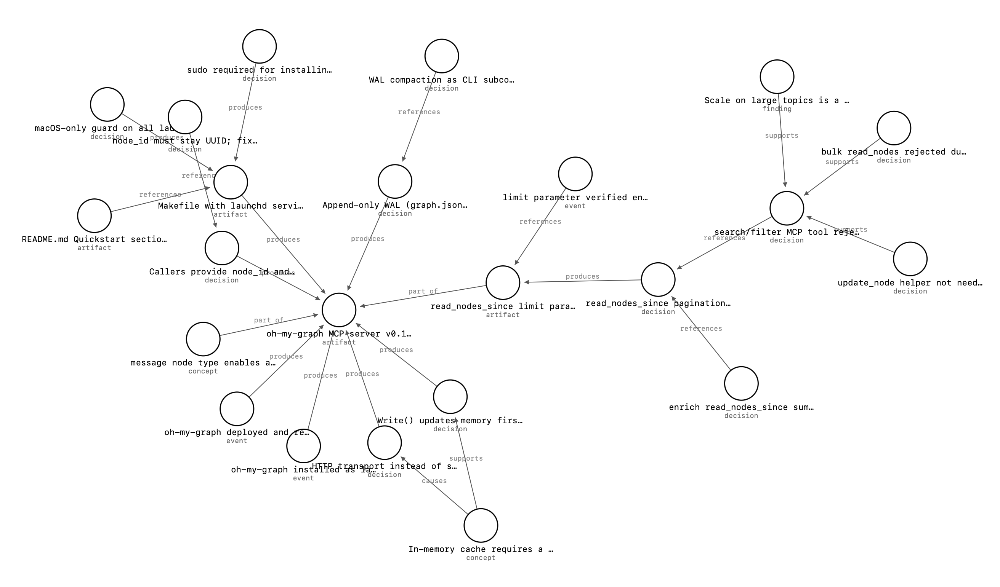

# oh-my-graph

**Continue the project, not the conversation.**

Every AI session starts fresh. Your project never does.

`oh-my-graph` gives AI agents persistent project understanding — implemented as a shared knowledge graph. Sessions are ephemeral; what agents learn about your project isn't.



## Why

AI sessions are ephemeral. Every new session — a new terminal, a new agent, a new person on the team — starts from zero, no matter how much the last one figured out.

Dropbox stores your files. Git stores the *evolution* of your project. Chat history stores a conversation. `oh-my-graph` stores the evolution of your project's *understanding* — the findings, decisions, and open questions multiple agents accumulate while working on it, so the next session picks up where the last one left off instead of re-discovering it.

**In practice:**

1. Session A (debugging a cache issue) discovers the root cause and writes a `finding` node: *"Redis cache hit rate dropped to 40% after v2.3 — key prefix change in config loader."*
2. A week later, Session B (a different agent, or the same one in a fresh context) starts work on the same project. It calls `read_nodes_since` and immediately sees Session A's finding — no re-discovery, no re-explaining.
3. Session B builds on it: writes a `decision` node fixing the prefix, linked back to the finding with a `resolves` edge.

Concretely, that means:

- **Persist findings** across sessions
- **Share knowledge** between concurrent agents working on the same project
- **Pass messages** between sessions using `message` nodes and `replies_to` edges
- **Track reasoning** with `supports`, `contradicts`, `causes`, `deprecates` edges

Under the hood, this is a graph of nodes and edges, persisted as an append-only WAL — see [Overview](#overview).

## Quickstart

**macOS** — installs as a launchd service that starts automatically on login:

```bash
brew install h0n9/devops/oh-my-graph
brew services start h0n9/devops/oh-my-graph
```

If you'd like to share the graph across multiple Macs, refer to the [Syncing across devices](#syncing-across-devices) section.

**Linux** — download the pre-built binary and place it in your `PATH` (replace `{VERSION}` with the desired version and `{ARCH}` with the architecture):

```bash
curl -sL https://github.com/h0n9/oh-my-graph/releases/download/v{VERSION}/oh-my-graph_linux_{ARCH}.tar.gz | tar xz -C /usr/local/bin
```

The server runs on port **7780** by default. Point your MCP client at `http://localhost:7780/mcp`.

Check the following sections for instructions on connecting MCP client to `oh-my-graph`:

- [Claude Desktop](#claude-desktop)
- [Claude Code](#claude-code)
- [Codex](#codex)

## Overview

`oh-my-graph` runs as an HTTP server that exposes a [Model Context Protocol (MCP)](https://modelcontextprotocol.io) interface. Multiple AI agents connect to a single server instance and share knowledge organized into **topics**.

Knowledge is stored as a graph of **nodes** (facts, concepts, questions, decisions, messages, ...) and **edges** (causal, epistemic, conversational relationships). The graph is persisted as an append-only JSONL file (`graph.jsonl`) per topic — like a write-ahead log.

```
~/.oh-my-graph/
├── life/
│   └── graph.jsonl
├── project-x/
│   └── graph.jsonl
└── comms/
    └── graph.jsonl
```

## Graph Visualization

Open **`http://localhost:7780/`** in your browser to explore the graph visually.

- **Topic list** — `GET /` lists all topics with node and edge counts
- **Force-directed graph** — `GET /graph?topic=<name>` renders a live interactive graph

## Data Model

### Node

```json
{
  "node_id": "uuid-v4",
  "type": "finding | concept | blocker | question | decision | artifact | entity | event | message",
  "summary": "one-liner",
  "description": "full markdown body",
  "confidence": 0.92
}
```

**Node types:**

| Type | Purpose |
|------|---------|
| `finding` | A discovered fact or observation |
| `concept` | An abstract idea or principle |
| `blocker` | Something preventing progress |
| `question` | An open unknown |
| `decision` | A made choice with rationale |
| `artifact` | A produced item (file, PR, doc) |
| `entity` | A real-world thing (person, system, service) |
| `event` | Something that happened |
| `message` | An inter-session message (see [Messaging](#messaging)) |

### Edge

```json
{
  "edge_id": "uuid-v4",
  "type": "resolves | produces | blocks | causes | supports | contradicts | depends_on | part_of | references | replies_to | deprecates",
  "from_node_id": "uuid-v4",
  "to_node_id": "uuid-v4"
}
```

**Edge types:**

| Type | Meaning |
|------|---------|
| `resolves` | Solution → blocker |
| `produces` | Process → artifact |
| `blocks` | Blocker → target |
| `causes` | Cause → effect |
| `supports` | Evidence → claim |
| `contradicts` | Counter-evidence → claim |
| `depends_on` | A requires B |
| `part_of` | A belongs to B |
| `references` | A cites B |
| `replies_to` | Message → message (threading) |
| `deprecates` | New node supersedes old node |

### Storage format (`graph.jsonl`)

Each line is a WAL record:

```json
{"seq":1,"type":"node","ts":"2026-06-18T12:00:00Z","data":{"node_id":"550e8400-e29b-41d4-a716-446655440000","type":"finding","summary":"Redis cache hit rate dropped to 40% after v2.3 deploy","description":"After deploying v2.3, Redis cache hit rate fell from 85% to 40%. Root cause: key prefix change in the new config loader.","confidence":0.92}}
{"seq":2,"type":"edge","ts":"2026-06-18T12:00:01Z","data":{"edge_id":"660e8400-e29b-41d4-a716-446655440001","type":"causes","from_node_id":"550e8400-e29b-41d4-a716-446655440000","to_node_id":"770e8400-e29b-41d4-a716-446655440002"}}
```

- `seq` — monotonically increasing sequence number (the cursor)
- `ts` — wall-clock time of append (RFC 3339)
- Records are **never modified or deleted** — use a `deprecates` edge instead

## MCP Tools

| Tool | Signature | Returns |
|------|-----------|---------|
| `list_topics` | `()` | `[]string` |
| `get_topic` | `(topic)` | `{last_cursor, node_count, edge_count}` |
| `read_nodes_since` | `(topic, cursor?, types?)` | `[]{node_id, type, summary, seq}` |
| `read_node` | `(topic, node_id)` | full node + all edges (in & out) |
| `write` | `(topic, nodes[], edges[])` | `{cursor}` |

`cursor` defaults to `0` — read from the beginning. `types` defaults to `["finding"]` when omitted; pass `types:["*"]` to return every node type, or a specific list (e.g. `["decision"]`) to narrow further.

## Messaging

Agents communicate asynchronously via `message` nodes in a shared topic:

1. **Session A** writes a `message` node to topic `"comms"`
2. **Session B** polls `read_nodes_since("comms", last_cursor, types:["message"])`, sees the message — note the explicit `types` here, since `read_nodes_since` only returns `finding` nodes by default
3. **Session B** replies with a new `message` node + `replies_to` edge pointing back

No extra infrastructure needed — the graph is the message bus.

## Usage

### Start the server

```bash
oh-my-graph                  # listens on :7780, data at ~/.oh-my-graph
oh-my-graph --port 8080      # custom port
oh-my-graph --data /var/omg  # custom data directory
```

The server loads each topic graph into memory on first access and flushes writes to disk asynchronously. Multiple agents may connect concurrently.

### Connect via MCP

Point your MCP client at `http://localhost:7780/mcp` (Streamable HTTP transport, JSON-RPC 2.0).

### Claude Desktop

Claude Desktop only supports stdio-based MCP servers. Use [`mcp-remote`](https://github.com/geelen/mcp-remote) as a bridge to the HTTP server.

Add the following to your Claude Desktop config file:

- **macOS:** `~/Library/Application\ Support/Claude/claude_desktop_config.json`
- **Windows:** `%APPDATA%\Claude\claude_desktop_config.json`

```json
{
  "mcpServers": {
    "oh-my-graph": {
      "command": "npx",
      "args": [
        "-y",
        "mcp-remote",
        "http://localhost:7780/mcp"
      ]
    }
  }
}
```

> The port above (`7780`) is the default. If you started the server with a different port, update the URL accordingly.

Then restart Claude Desktop. The `oh-my-graph` tools (`list_topics`, `get_topic`, `read_nodes_since`, `read_node`, `write`) will appear automatically in your Claude sessions.

### Claude Code

Claude Code natively supports Streamable HTTP MCP — no bridge required.

**Via CLI** (writes to `~/.claude.json` at user/global scope, so the server is available from every project):

```bash
claude mcp add oh-my-graph --transport http --scope user http://localhost:7780/mcp
```

> Omitting `--scope user` defaults to **local** scope — the server is only visible from the directory you ran the command in. Since `oh-my-graph` runs as a permanent background service, global scope is almost always what you want.

**Manually** — add to `~/.claude.json` (global) or `.claude/settings.json` (project):

```json
{
  "mcpServers": {
    "oh-my-graph": {
      "type": "http",
      "url": "http://localhost:7780/mcp"
    }
  }
}
```

**Tip:** Add the following to your `~/.claude/CLAUDE.md` so Claude automatically loads graph context at the start of every session:

````markdown
## oh-my-graph Knowledge Graph

At the start of every session, connect to the `oh-my-graph` MCP server:

1. Call `list_topics` to discover existing topics.
2. Infer the topic from context — working directory name, project name, or the user's first message.
3. Call `read_nodes_since(<topic>)` (cursor 0) to load existing findings before responding. This defaults to `finding` nodes only — pass `types` (e.g. `["decision"]`) or `types:["*"]` if the session needs decisions, blockers, or questions too.

During the session, call `write` frequently to persist findings, decisions, and artifacts. Link related nodes with edges to preserve reasoning chains.
````

### Codex

Add to `~/.codex/config.yaml`:

```yaml
mcp_servers:
  - name: oh-my-graph
    type: http
    url: http://localhost:7780/mcp
```

Codex will surface the `list_topics`, `get_topic`, `read_nodes_since`, `read_node`, and `write` tools in every session.

## Syncing across devices

Symlinking the data directory into iCloud Drive lets you share your graph across multiple Macs and browse it on iPhone. The service reads and writes through the symlink transparently.

**Fresh install (no existing data):**

```bash
mkdir -p "$HOME/Library/Mobile Documents/com~apple~CloudDocs/oh-my-graph"
ln -s "$HOME/Library/Mobile Documents/com~apple~CloudDocs/oh-my-graph" ~/.oh-my-graph
brew services start h0n9/devops/oh-my-graph
```

**Existing data at `~/.oh-my-graph`:**

> **Back up your data before migrating.** `mv` is destructive — if something goes wrong mid-way, you could lose data.
> ```bash
> cp -r ~/.oh-my-graph ~/.oh-my-graph.bak
> ```

```bash
brew services stop h0n9/devops/oh-my-graph
mv ~/.oh-my-graph "$HOME/Library/Mobile Documents/com~apple~CloudDocs/oh-my-graph"
ln -s "$HOME/Library/Mobile Documents/com~apple~CloudDocs/oh-my-graph" ~/.oh-my-graph
brew services start h0n9/devops/oh-my-graph
```

On each additional Mac, run the following commands — the symlink will point to the same iCloud directory already populated by the first machine.

```bash
brew services stop h0n9/devops/oh-my-graph
rm -rf ~/.oh-my-graph
ln -s "$HOME/Library/Mobile Documents/com~apple~CloudDocs/oh-my-graph" ~/.oh-my-graph
brew services start h0n9/devops/oh-my-graph
```

> Make sure only one machine runs the server at a time to avoid concurrent writes to the same file.

## Development

```bash
git clone https://github.com/h0n9/oh-my-graph
cd oh-my-graph
make run    # go run — starts the server on port 7780
make build  # produces ./oh-my-graph binary
make clean  # removes the binary
```

Requires Go 1.26+. No external dependencies.

## Benchmarks

Measured on Apple M1 Pro (`go test ./internal/graph/... ./internal/mcp/... -bench=. -run=^$ -benchmem`):

### Storage layer (`internal/graph`)

| Benchmark | Scenario | Time/op | Memory/op | Allocs/op |
|-----------|----------|---------|-----------|-----------|
| `BenchmarkNodesSinceRareTypeFilter` | `read_nodes_since` filtered to a single type, with 1 matching node buried behind 50,000 nodes of another type | 57.5 ns | 64 B | 1 |
| `BenchmarkNodesSinceWildcard` | `read_nodes_since` with no type filter, over 50,000 nodes | 348 ns | 581 B | 1 |
| `BenchmarkNodesSinceMultiType` | `read_nodes_since` merging 3 types, 10,000 nodes each | 7.48 µs | 16.0 KB | 9 |
| `BenchmarkGetNode` | `read_node` on a node with 2 edges, in a 10,000-node graph | 112 ns | 48 B | 2 |
| `BenchmarkWriteBatch` | `write` — single-node batch (validate + in-memory commit + async WAL append) | 7.34 µs | 1.6 KB | 11 |
| `BenchmarkWriteBatchLarge` | `write` — 50-node batch | 83.9 µs | 68.2 KB | 362 |
| `BenchmarkWriteParallel` | `write` — single-node batches from concurrent callers | 7.48 µs | 1.2 KB | 10 |
| `BenchmarkSnapshot` | full graph snapshot (backs `/api/graph`), 10,000 nodes + 5,000 edges | 138 µs | 121 KB | 3 |
| `BenchmarkTopicLoad` | cold start: opening a topic backed by an existing 20,000-node WAL file | 55.9 ms | 24.0 MB | 320,230 |

`read_nodes_since` keeps a separate log per node type, so filtering by type costs O(log N) regardless of how rare the requested type is, instead of scanning every node to find matches. Cold-start topic load is the one operation that's still O(L) in total WAL history — everything else is O(1), O(log N), or O(deg(v)).

### Protocol layer (`internal/mcp`) — full JSON-RPC round trip

| Benchmark | Scenario | Time/op | Memory/op | Allocs/op |
|-----------|----------|---------|-----------|-----------|
| `BenchmarkWriteHandler` | `write` tool call — JSON args in, `Write`, JSON result out | 7.91 µs | 2.4 KB | 31 |
| `BenchmarkReadNodesSinceHandler` | `read_nodes_since` tool call, default filter, over 1,000 seeded nodes | 17.7 µs | 18.3 KB | 11 |

These include JSON marshal/unmarshal overhead on top of the storage-layer cost above — closer to what an actual MCP client call pays end to end.

Reproduce locally:

```bash
go test ./internal/graph/... ./internal/mcp/... -bench=. -run=^$ -benchmem
```

## License

Apache 2.0 — see [LICENSE](LICENSE) for details.
